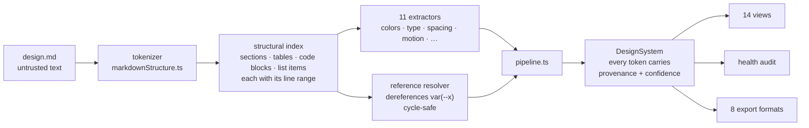

<!--
  FOLLOW-UP still open: add a screenshot or short demo GIF of the explorer.
  The social card is generated by .github/workflows/og-card.yml from docs/og-card.html;
  download its artifact and upload it under Settings -> General -> Social preview.
-->

<div align="center">


# Design.md Visual Explorer

**Drop a design-system markdown file into the browser. Get a navigable, audited, exportable design system back.**

No schema to adopt. No front matter. No backend. Nothing leaves your machine.

[**Try it →**](https://alebgl77.github.io/design-md-viewer/)

[](https://github.com/alebgl77/design-md-viewer/actions/workflows/ci.yml)
[](LICENSE)

</div>

---

## See it work

Here is a real document. Nothing about it was written for this tool:

```markdown
## Colour

| Token   | Value   | Usage                  |
| ------- | ------- | ---------------------- |
| Primary | #2563eb | Primary actions, links |
| Surface | #f8fafc | Page background        |
| Danger  | #dc2626 | Destructive actions    |

## Type Scale

| Token   | Size | Weight | Line height |
| ------- | ---- | ------ | ----------- |
| Display | 48px | 700    | 1.1         |
| Body    | 16px | 400    | 1.5         |

## Spacing

- **xs**: 4px
- **md**: 16px

## Motion

- **fast**: 150ms ease-out
- **base**: 250ms cubic-bezier(0.4, 0, 0.2, 1)
```

Thirty-two lines in. This comes out:

| Token   | Value     | Contrast on the declared surface | Source        |
| ------- | --------- | -------------------------------- | ------------- |
| Primary | `#2563eb` | 5.16:1 — passes AA               | `orbit.md:9`  |
| Surface | `#f8fafc` | 17.06:1 — passes AA              | `orbit.md:10` |
| Danger  | `#dc2626` | 4.82:1 — passes AA               | `orbit.md:11` |

| Token   | Size | Weight | Line height | Source        |
| ------- | ---- | ------ | ----------- | ------------- |
| Display | 48px | 700    | 1.1         | `orbit.md:18` |
| Body    | 16px | 400    | 1.5         | `orbit.md:19` |

| Token | Duration | Easing                         | Source        |
| ----- | -------- | ------------------------------ | ------------- |
| fast  | 150ms    | `ease-out`                     | `orbit.md:30` |
| base  | 250ms    | `cubic-bezier(0.4, 0, 0.2, 1)` | `orbit.md:31` |

Categories detected: **Colors, Typography, Spacing, Motion** — and only those. The document declares no
shadows, no breakpoints and no components, so those views never appear. A colors-only file gets a
colors-only app.

Every row above carries the line number it came from. Click it and the Source view scrolls to that exact
line, highlighted. That is the point of the whole project: when the parser gets something wrong, you can
see _why_ in one click, instead of trusting it.

## Why

Design systems get written down long before they get coded — a `DESIGN.md`, a Notion export, a brand
guideline PDF pasted into a repo. That document is readable but not _inspectable_. You cannot see the
palette. You cannot check a contrast ratio. You cannot tell whether the spacing scale is actually a scale.
And you certainly cannot hand it to Tailwind.

This closes that gap without asking the document to change.

## 100% client-side

The file you load is parsed in your browser and never leaves it.

- No backend, no server, no database. The whole app is static files.
- No upload endpoint, no analytics, no telemetry, no cookies.
- The only network requests the app makes are the webfont stylesheet, and — if you explicitly opt in — the
  AI enrichment call described below.

It runs perfectly well from an internal share or any static host.

## How the parser works

Deterministic by design: the same document always produces the same object, with no model in the loop.



**1. Tokenizer** makes a single pass over the raw text and produces a flat structural index. Every record
keeps its start line, end line and heading path. This is the only stage that touches raw text; everything
downstream works on the structure. Sanitization here is line-preserving, so a recorded line number is always
an index into the document you actually see.

**2. Extractors** — one module per category, eleven of them. Each reads the shared index and looks for its
own category wherever it can plausibly appear: a markdown table, a CSS or JSON code block, a bullet list, or
prose. Extractors never see each other's output, which keeps them independently testable and makes adding a
category an additive change.

**3. Reference resolver** collects every CSS custom property declared in the document's code blocks and
dereferences aliases recursively, with cycle detection, so a token defined as `var(--brand-500)` reports the
value it ultimately points at.

**4. Pipeline** runs the stages, decides which categories were actually detected, and assembles the
`DesignSystem` object.

### Provenance is a type-level requirement

Every token embeds this, and it is not optional:

```ts
interface Provenance {
  sectionTitle?: string;
  headingPath: string[];
  lineNumber?: number;
  lineEnd?: number;
  rawSourceSnippet: string;
}

type ExtractionConfidence = 'explicit' | 'inferred';
```

Because provenance is mandatory in the schema, an extractor _cannot_ emit a value it is unable to point at.
And `confidence` separates what the document stated from what the parser derived, so the two are never
silently blended.

## Features

- **Fourteen views** — Overview, Colors, Typography, Spacing, Radius, Shadows, Borders, Breakpoints,
  Components, Motion, Accessibility, Tokens, Health Audit, Source. Only detected categories appear.
- **Health audit** — a scored report (A+ to D) covering WCAG AA contrast failures, near-duplicate colors,
  off-grid spacing, odd-pixel font sizes, missing functional palettes, and components with incomplete
  interactive states. Every issue carries a recommendation and a weighted impact score.
- **Accessibility tooling** — contrast computed against the document's _declared_ background rather than a
  hardcoded one, with AA/AAA verdicts, plus color-vision simulation for protanopia, deuteranopia,
  tritanopia and achromatopsia.
- **Eight export formats** — W3C Token JSON, Tailwind v4 `@theme`, Tailwind v3 config, CSS custom
  properties, a TypeScript theme object, SCSS variables, an AI prompt / `.cursorrules` block, and a
  normalized `DESIGN.md`.
- **Instant search** across every token and section on `Cmd/Ctrl + K`, jumping straight to the source line.
- **Light and dark themes**, because you cannot honestly judge a light design system's colors on a dark
  chrome.
- **Four built-in samples** and a starter-template scaffolder, so you can try it without a file ready.

## Untrusted input is treated as untrusted

A `design.md` is a file teams pass around and that agents generate. This project assumes it may be hostile.

- Script tags and `javascript:` URLs are stripped before parsing, newline-for-newline so line numbers stay
  honest.
- Values reaching a stylesheet are sanitized for CSS grammar; values reaching a JS or JSON literal are
  emitted through `JSON.stringify` rather than interpolated into a template. A token value cannot contribute
  syntax to an exported file.
- Prompt-injection text inside a document stays inert data. There is a test for exactly that.
- A Content Security Policy ships in the document itself, since GitHub Pages serves no headers this
  project controls. Scripts are pinned to first-party code plus one hashed inline bootstrap, and the
  page can reach exactly one external origin.

The threat model and how to report an issue are in [SECURITY.md](SECURITY.md).

## Quickstart

Requires Node 20 or newer.

```bash
git clone https://github.com/alebgl77/design-md-viewer.git
cd design-md-viewer

npm install     # install dependencies
npm run dev     # dev server on http://localhost:5173
npm test        # Vitest suite
npm run build   # type-check and emit static files to dist/
```

`npm run typecheck` runs `tsc --noEmit` alone; `npm run preview` serves the built `dist/`.

The build emits relative asset URLs, so `dist/` works from a domain root or any subdirectory.

## Tech stack

| Layer   | Choice                                          |
| ------- | ----------------------------------------------- |
| UI      | React 18 + TypeScript (strict)                  |
| Build   | Vite 6                                          |
| Styling | Tailwind CSS 3, driven by CSS custom properties |
| Tests   | Vitest                                          |
| Icons   | lucide-react                                    |

No router: view switching is plain React state, which keeps the bundle small and static hosting trivial.

## Optional AI enrichment

The parser is fully deterministic and the app is completely usable without any AI. Enrichment is an opt-in
extra that adds only the conceptual metadata a document rarely states outright: a tagline, a design
philosophy, a visual tone, principles, and short usage guidance per component.

- It requires **your own Google Gemini API key**.
- The key stays in your browser and travels in a request header, never in a URL. A key in a query
  string leaks into browser history and into every log between you and the API; a header does not.
  There is no server in this project that could receive it either way, because there is no server.
- The hosted build talks to exactly one origin. The Content Security Policy in `index.html` pins
  `connect-src` to the Gemini API, so a parsed document cannot be sent anywhere. Routing enrichment
  through your own proxy therefore means self-hosting and widening that one line deliberately.
- It is constrained to conceptual fields. It never invents hex codes or pixel measurements, and the response
  is validated against a Zod schema before anything reaches the UI.
- Without a key, the app runs at full functionality on deterministic parsing alone.

## License

MIT — see [LICENSE](LICENSE). Copyright (c) 2026 Alexandre Beguel.
